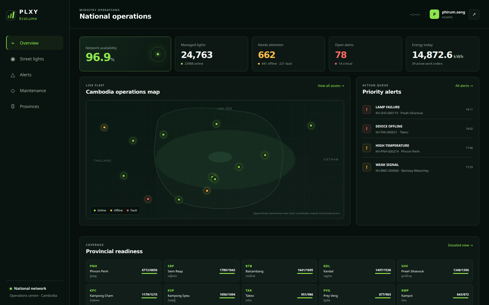
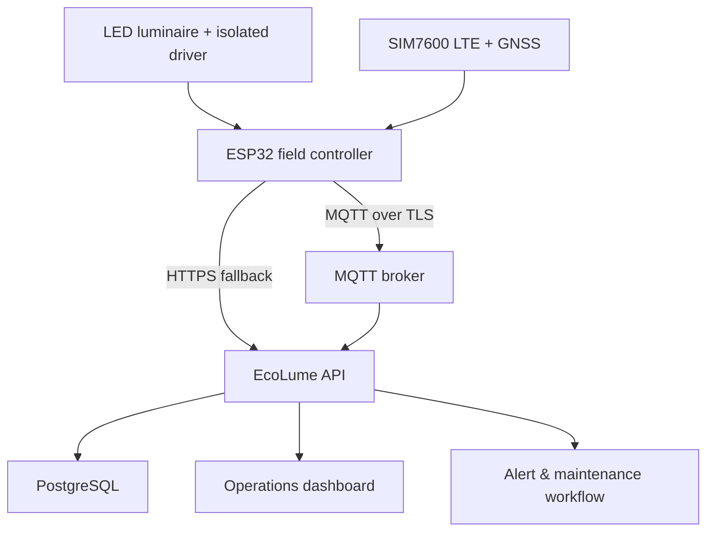

# PLXY EcoLume

PLXY EcoLume is an open, secure-by-design smart street-light management platform for nationwide public-lighting operations. It combines an ESP32 cellular/GNSS field controller with a central web platform for live monitoring, remote dimming, fault alerts, and maintenance coordination across Cambodia's 24 provinces and Phnom Penh.

> **Status:** working MVP/reference implementation. Before public-road deployment, complete electrical certification, carrier testing, security review, field calibration, redundancy testing, and ministry acceptance. Never connect an ESP32 directly to mains voltage.

## What is included

- `firmware/` — PlatformIO firmware for ESP32 + SIM7600, GPS, INA219 metering, temperature, PWM/relay control, MQTT telemetry, command handling, offline queue, and watchdog.
- `backend/` — TypeScript/Express service with PostgreSQL, authenticated admin portal, device API, MQTT ingestion, alert rules, work orders, audit logs, and health checks.
- `scripts/device-simulator.ts` — simulated street lights for demonstrations and load testing.
- `docker-compose.yml` — PostgreSQL, Mosquitto, backend, and simulator-ready local deployment.
- `docs/` — architecture, hardware, security, deployment, API, and field rollout guidance.

## Core capabilities

| Area | Capability |
|---|---|
| Fleet | Asset registry, province/city grouping, GPS, device and firmware status |
| Operations | Live status, brightness control, desired-vs-actual state, last contact |
| Telemetry | Voltage, current, power, accumulated energy, temperature, RSSI, GNSS |
| Alerts | Offline, lamp failure, abnormal voltage, over-temperature, tamper |
| Maintenance | Work orders, priority, assignment, status, due date, alert linkage |
| Security | Per-device tokens, hashed credentials, TLS-ready MQTT, RBAC, audit trail |
| Resilience | Cellular reconnect, local safety schedule, queued telemetry, watchdog |

## Admin operations centre



The responsive admin portal provides national fleet availability, live asset locations, electrical status, energy usage, priority alerts, provincial readiness, remote commands, and maintenance workflows. This screenshot was rendered from the actual dashboard code with representative demonstration data—no production credentials or ministry asset locations are included.

## Architecture



## Quick start

1. Copy the environment template and set strong secrets:

   ```bash
   cp .env.example .env
   ```

2. Start the platform:

   ```bash
   docker compose up --build
   ```

3. Open `http://localhost:8080` and sign in with the strong one-time values configured in `ADMIN_USERNAME` and `ADMIN_INITIAL_PASSWORD`.

4. Simulate devices:

   ```bash
   docker compose --profile simulator up simulator
   ```

Detailed instructions are in [Deployment](docs/DEPLOYMENT.md) and [Firmware](firmware/README.md).

## Default topics and API

- Telemetry: `ecolume/v1/devices/{deviceId}/telemetry`
- Commands: `ecolume/v1/devices/{deviceId}/commands`
- Events/acknowledgements: `ecolume/v1/devices/{deviceId}/events`
- HTTPS fallback: `POST /api/v1/device/telemetry`
- Health: `GET /health`

See [API and MQTT contract](docs/API.md).

## Development

```bash
cd backend
npm install
npm run typecheck
npm test
npm run dev
```

Firmware:

```bash
cd firmware
cp include/config.example.h include/config.h
pio run
```

## Safety and privacy

- Do not store production credentials, SIM PINs, precise government asset locations, or broker certificates in Git.
- The repository does not include a software license. Copyright remains with the repository owner unless a license is added.
- Follow Cambodia's electrical, telecommunications, cybersecurity, procurement, and personal-data requirements.
- Use certified surge protection, galvanic isolation, weatherproof enclosures, proper earthing, and qualified electrical engineers.

## Roadmap

- Pilot: 20–50 lights in one district
- Controlled rollout: two provinces with carrier and maintenance-team validation
- National rollout: regional brokers, high-availability database, disaster recovery, SIEM integration, and 24/7 NOC/SOC procedures
