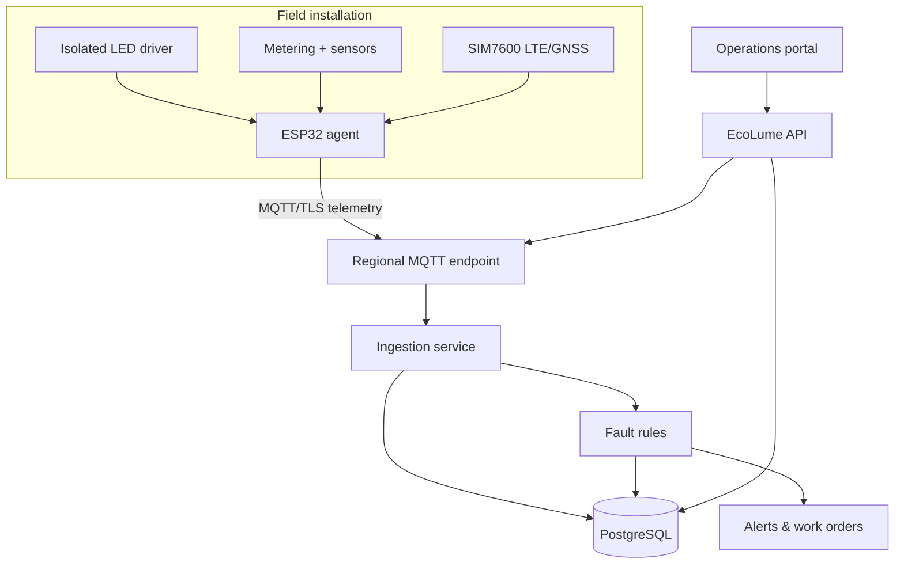

# System architecture

## Scope

EcoLume is designed to manage public LED lighting across Cambodia's 24 provinces and Phnom Penh. The MVP uses a modular monolith so a small team can deploy and operate it safely; MQTT ingestion, alert evaluation, reporting, and command services can later be split without changing the device contract.

## Logical components

## Field behavior

1. The controller reads electrical, thermal, ambient-light, GNSS, tamper, and cellular data.
2. It publishes a versioned telemetry message every 60 seconds.
3. During carrier or broker failure, recent samples remain in a bounded queue.
4. The controller subscribes only to its own command topic.
5. If central control is unavailable, a local safety policy restores illumination instead of leaving a road dark.

The MVP queue is memory-backed. Production firmware should persist a wear-levelled ring buffer in LittleFS/NVS and use signed A/B OTA with rollback.

## Central behavior

- PostgreSQL is the system of record for assets, samples, alerts, commands, work orders, and audit events.
- MQTT ingestion and HTTPS fallback use the same validated telemetry service.
- Alert creation is idempotent per light and fault type.
- Commands record desired state before MQTT publication and remain queued if the broker is unavailable.
- The offline monitor changes device state when telemetry exceeds the configured threshold.

## Operations map

The live-fleet map is rendered server-side as SVG from boundary data bundled in
`backend/src/public/geo/`. No tile service is contacted, so an operations centre
without internet access keeps working and the position of ministry assets is
never disclosed to a third-party host by the act of drawing them.

`MAP_REGION` sets the default view (`KH` for the whole country, `KH-PNH` for one
province); operators can switch region from the dashboard, and the choice rides
in the `?region=` query string. Boundary outlines and asset pins share a single
projection in `services/regions.ts`, so a pin cannot drift away from the outline
beneath it.

> [!IMPORTANT]
> The bundled boundaries come from Natural Earth 1:10m (public domain). They are
> generalized cartographic data for display, **not a legal boundary source**, and
> the vintage predates the 2013 creation of Tboung Khmum — that province is
> selectable but falls back to the national outline. Before ministry acceptance,
> replace `backend/src/public/geo/kh.json` with the official national boundary
> file and re-run `tools/build-region-data.mjs`.

Adding another country is a data change, not a code change: add its ISO
subdivision-to-province mapping in `tools/build-region-data.mjs`, regenerate, and
the new country appears in the region selector.

## Scaling targets

Example sizing for 100,000 lights at one sample/minute:

- 1,667 telemetry messages/second average;
- 144 million samples/day before aggregation;
- raw retention must be tiered—short-term PostgreSQL/TimescaleDB plus long-term object storage;
- regional MQTT endpoints reduce carrier latency and failure domains.

The MVP PostgreSQL schema is appropriate for pilot and controlled rollout. Before national scale:

- add TimescaleDB or a streaming/time-series tier;
- partition telemetry by time;
- run at least three MQTT broker nodes across failure domains;
- use PostgreSQL HA with tested point-in-time recovery;
- add a message stream between ingestion and rule processing;
- define RTO/RPO, DR exercises, NOC/SOC monitoring, and capacity alerts.

## Asset identity

Recommended identifier: `KH-{PROVINCE_CODE}-{SEQUENCE}`, for example `KH-PNH-000001`. The identifier is printed as a QR code on the pole/controller and remains stable when SIM cards or components change.

## Technology choices

| Layer | MVP choice | Rationale |
|---|---|---|
| Controller | ESP32 | Memory for TLS, MQTT, GNSS, watchdog, and future signed OTA |
| Modem | SIM7600 | LTE plus integrated GNSS; final model depends on Cambodian carrier bands |
| Protocol | MQTT 3.1.1 over TLS | Low overhead and command/telemetry topic isolation. The broker and API are TLS-ready; the SIM7600 firmware build is not yet — see [Security](SECURITY.md#transport-security-on-the-sim7600-build) |
| API | Node.js + TypeScript + Express | Simple operations, strict contracts, broad support |
| Database | PostgreSQL 16 | Transactions, JSONB, reporting, mature HA options |
| Portal | Server-rendered responsive UI | Small attack surface and deployable as one service |

