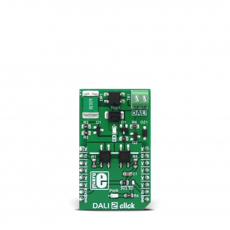
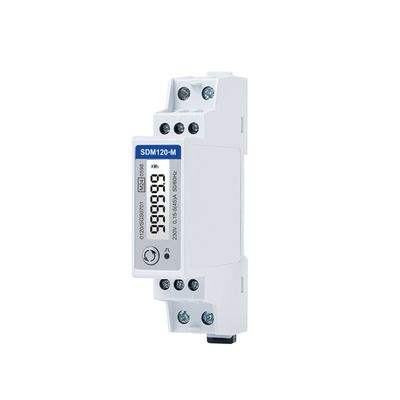
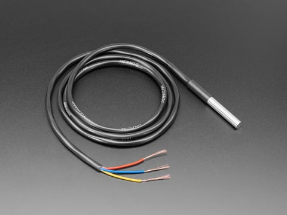
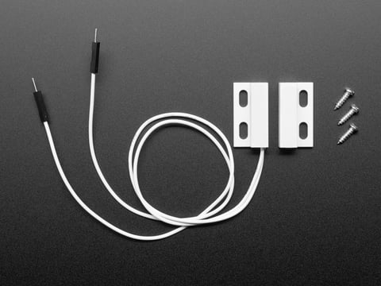
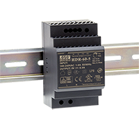
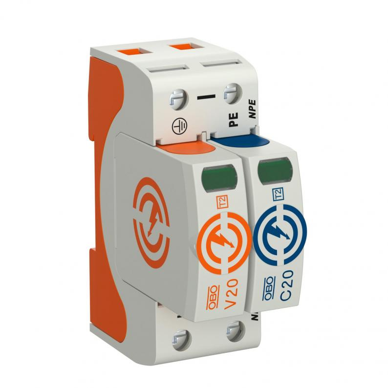
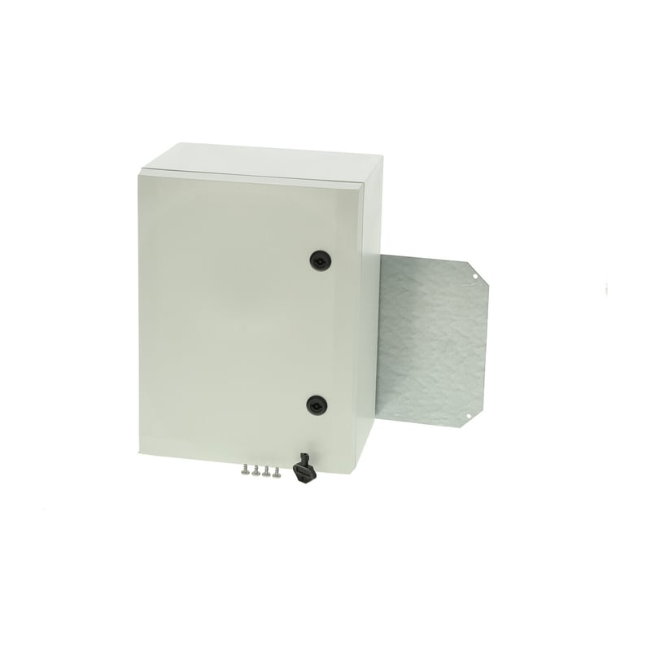

# Reference hardware design

This is a functional reference, not an approved electrical design. A licensed electrical engineer and accredited laboratory must review the final PCB, enclosure, wiring, EMC, surge, thermal, and safety design.

## Proposed controller

| Component | Searchable market example | Purpose |
|---|---|---|
| MCU | Espressif ESP32-DevKitC V4 with ESP32-WROOM-32E | Secure application controller |
| LTE/GNSS | Waveshare SIM7600G-H 4G HAT (B) | Cellular data and positioning |
| LED control | MikroE DALI 2 Click, MIKROE-2672 | Isolated DALI communication with a certified driver |
| Metering | Eastron SDM120-M Modbus | AC voltage, current, power, and energy |
| Temperature | Adafruit waterproof DS18B20 probe, product 381 | Driver/controller thermal monitoring |
| Ambient light | Adafruit BH1750 breakout, product 4681 | Day/night evidence and adaptive dimming |
| Tamper | Adafruit magnetic contact switch, product 375 | Cabinet access alarm |
| Power | MEAN WELL HDR-30-5 | Isolated 5 V controller supply |
| Protection | OBO V20-1+NPE-280, item 5095251 | Type 2 surge protection for a single-phase supply |
| Enclosure | Fibox ARCA 403021, product 8120007 | UV-resistant IP66 outdoor protection |

The named products make the parts easy to recognize and search for. They are purchasing examples, not an approved bill of materials. Prices, stock, regional variants, certifications, and product revisions can change. A qualified engineer must approve every mains-connected or road-installed part.

## Equipment picture and market guide

### 1. MCU: Espressif ESP32-DevKitC V4

- **Search:** `Espressif ESP32-DevKitC V4 ESP32-WROOM-32E`
- **Product reference:** [Espressif ESP32-DevKitC V4 guide](https://docs.espressif.com/projects/esp-dev-kits/en/latest/esp32/esp32-devkitc/user_guide.html)
- **Use:** Firmware development, sensor integration, MQTT, and controller bench testing.
- **Check before buying:** The module marking should say `ESP32-WROOM-32E` or the specifically approved replacement. Confirm genuine-module traceability, available UART/GPIO pins, flash size, and operating-temperature rating.
- **Deployment note:** The DevKitC is a development board. A road unit needs a production PCB, secure credential storage, watchdog and brownout design, protected I/O, and completed EMC/environmental testing.

### 2. LTE/GNSS: Waveshare SIM7600G-H 4G HAT (B)

- **Search:** `Waveshare SIM7600G-H 4G HAT B global band GNSS`
- **Product reference:** [Waveshare SIM7600G-H 4G HAT (B)](https://www.waveshare.com/sim7600g-h-4g-hat-b.htm)
- **Use:** LTE data, GNSS positioning, SIM testing, and AT-command integration.
- **Check before buying:** Match the exact SIM7600 regional variant and LTE bands to the selected Cambodian carriers. Confirm that the board includes the correct main, diversity, and GNSS antennas and supports UART or USB operation with the controller.
- **Deployment note:** Treat this HAT as a prototype/pilot reference. Validate transmit-current peaks, antenna placement, lightning protection, APN behavior, heat, and reconnect performance before selecting a production modem assembly.

### 3. LED control: MikroE DALI 2 Click

- **Search:** `MIKROE-2672 DALI 2 Click`
- **Product reference:** [MikroE DALI 2 Click](https://www.mikroe.com/dali-2-click)
- **Use:** Bench and lab development of the isolated DALI physical interface between the MCU and DALI lighting bus.
- **Check before buying:** Confirm 3.3 V logic compatibility, isolation, DALI bus voltage/current requirements, and whether a separate DALI bus power supply is required. Availability can vary, so search by the exact part number.
- **Deployment note:** This board is a development interface, not the complete street-light power path. Production requires an engineer-approved DALI-2 interface, bus supply, certified DALI-2 LED driver, safe clearances, and a compatible luminaire. Use an isolated 0–10 V interface instead only when the selected driver requires it.

### 4. Metering: Eastron SDM120-M Modbus

- **Search:** `Eastron SDM120-M RS485 Modbus 45A DIN rail`
- **Product reference:** [Eastron SDM120-M](https://www.eastrongroup.com/product/single-phase-multifunction-energy-meter/rs485-modbus-dlt645-din-rail-single-phase-multifunction-energy-meter.html)
- **Use:** Isolated, DIN-rail measurement of AC voltage, current, active power, power factor, frequency, and energy over RS-485 Modbus.
- **Check before buying:** Verify that the label and order code include `SDM120-M` and RS-485 Modbus, not the pulse-only `SDM120-P`. Confirm supply topology, current range, Modbus register map, certification, and an isolated RS-485 interface for the MCU.
- **Deployment note:** Mains wiring, upstream protection, conductor size, disconnects, and enclosure layout must be designed and installed by qualified personnel.

### 5. Temperature: waterproof DS18B20 probe

- **Search:** `Adafruit 381 waterproof DS18B20 temperature probe`
- **Product reference:** [Adafruit waterproof DS18B20, product 381](https://www.adafruit.com/product/381)
- **Use:** Low-voltage prototype measurement of enclosure, driver-case, or heat-sink temperature.
- **Check before buying:** Use a traceable supplier because visually identical probes may contain clone sensors. Confirm cable length, temperature range, three-wire pinout, pull-up resistor, mounting method, and calibration error.
- **Deployment note:** “Waterproof” describes the probe assembly, not automatic suitability for years of outdoor cabinet service. Production should use a calibrated industrial probe with rated cable, gland, insulation, and thermal attachment.

### 6. Ambient light: Adafruit BH1750 breakout

- **Search:** `Adafruit 4681 BH1750 light sensor STEMMA QT`
- **Product reference:** [Adafruit BH1750, product 4681](https://www.adafruit.com/product/4681)
- **Use:** Low-voltage prototype sensing for day/night evidence and adaptive-dimming experiments over I²C.
- **Check before buying:** Confirm the BH1750 marking, supported supply/logic voltage, I²C address, maximum useful lux range, and library compatibility.
- **Deployment note:** The exposed breakout is not weatherproof. A road unit needs a production sensor behind a UV-stable optical window, protected against condensation and direct water, then calibrated in the final enclosure.

### 7. Tamper: magnetic contact switch

- **Search:** `Adafruit 375 magnetic contact switch door sensor`
- **Product reference:** [Adafruit magnetic contact switch, product 375](https://www.adafruit.com/product/375)
- **Use:** Prototype cabinet-door detection. Mount the magnet on the door so the monitoring loop is closed while the cabinet is closed and alarms when the door opens or the cable is cut.
- **Check before buying:** Confirm the contact behavior with a multimeter, required sensing gap, lead length, mounting clearance, contact rating, and the controller input's pull-up and debounce behavior.
- **Deployment note:** The pictured ABS contact is for identification and prototyping. Use a field-rated sealed contact or mechanically protected normally closed tamper switch for production.

### 8. Power: MEAN WELL HDR-30-5

- **Search:** `MEAN WELL HDR-30-5 5V 3A DIN rail power supply`
- **Product reference:** [MEAN WELL HDR-30 datasheet](https://www.meanwell.com/Upload/PDF/HDR-30/HDR-30-SPEC.PDF)
- **Use:** DIN-rail isolated conversion from AC mains to 5 V DC for the low-voltage controller and modem subsystem.
- **Check before buying:** The exact model must be `HDR-30-5`, rated 5 V at 3 A. Recalculate continuous load, SIM7600 transmit peaks, start-up, hold-up time, temperature derating, wiring terminals, and protective-device coordination.
- **Deployment note:** Do not assume 3 A is sufficient for every assembled unit. Validate voltage drop and peak current at the modem and provide separately protected low-voltage branches where required.

### 9. Surge protection: OBO V20-1+NPE-280

- **Search:** `OBO V20-1+NPE-280 5095251 type 2 SPD`
- **Product reference:** [OBO V20-1+NPE-280, item 5095251](https://www.obo-bettermann.com/en-xi/products/surge-arrester-v20-1-pole-npe-280-v-ip20-280-1-n-pe-5095251.html)
- **Use:** DIN-rail Type 2 surge protection for a compatible 230 V single-phase TN-S/TT installation.
- **Check before buying:** Match item `5095251`, network topology, maximum continuous voltage, backup fuse, short-circuit rating, status indication, conductor length, and earthing arrangement to the engineered design.
- **Deployment note:** This SPD is only one layer. The final system may also require upstream lightning-current protection, a fuse or breaker, coordinated MOV/TVS/GDT protection, filtering, bonding, and a verified low-impedance earth path.

### 10. Enclosure: Fibox ARCA 403021

- **Search:** `Fibox ARCA 403021 8120007 IP66 polycarbonate enclosure`
- **Product reference:** [Fibox ARCA 403021, product 8120007](https://www.fibox.com/products/arca-iec/arca-403021/8120007)
- **Use:** UV-resistant polycarbonate cabinet for the controller, DIN-rail equipment, terminals, and protected cable entry.
- **Check before buying:** Confirm product `8120007`, 400 × 300 × 210 mm dimensions, mounting plate, IP66/IK10 ratings, UV rating, lock type, pole-mount kit, rain canopy, DIN-rail frame, glands, vents, and internal heat load.
- **Deployment note:** Cutting holes or fitting incorrect glands can invalidate ingress protection. Verify condensation control, drainage, creepage/clearance, separation of mains and SELV wiring, door bonding where applicable, and service access in the completed assembly.

The INA219 in reference firmware is for safe low-voltage prototyping only. Do not place it on mains or on a high-voltage LED string.

## Cellular selection

Before choosing the exact SIM7600 part:

1. Obtain supported LTE bands and M2M/IoT APN options from Cambodian carriers.
2. Test urban, rural, and border locations across the target provinces.
3. Confirm static/private APN, VPN, SIM lifecycle, monthly quota, roaming policy, and SMS/data attack controls.
4. Select an outdoor-rated antenna with correct placement, grounding, and surge protection.
5. Size the supply for modem transmit-current peaks and cold-start behavior.

## Driver integration

DALI-2 is preferred when the luminaires support it because it offers standardized addressing and diagnostic data. Isolated 0–10 V can be used for simpler drivers. A relay/contactor should only switch power when rated for the LED driver's inrush current and required switching cycles.

## Prototype stages

1. Bench prototype at safe low voltage.
2. Isolated driver-interface prototype inside an electrical lab.
3. Environmental and surge test unit.
4. Ten-unit supervised road pilot.
5. Fifty-unit operational pilot with two carrier coverage profiles.
6. Design freeze after corrective actions and independent security/safety review.

## Data calibration

Store calibration coefficients per controller and record:

- reference instrument and calibration date;
- error at low, typical, and high load;
- temperature offset;
- GNSS accuracy distribution;
- modem RSSI/RSRP/RSRQ mapping;
- firmware and hardware revision.

