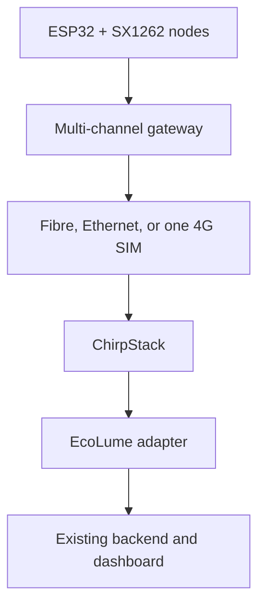
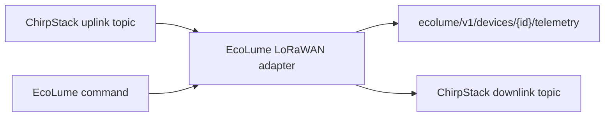

# Option 2 — Low-cost LoRaWAN field network

This guide adds a second communication design for PLXY EcoLume:

- each street-light controller uses an ESP32 and an SX1262 LoRa radio;
- nearby controllers communicate with one or more multi-channel LoRaWAN gateways;
- each gateway uses one shared 4G SIM, fibre, or Ethernet connection;
- ChirpStack receives LoRaWAN frames and an EcoLume adapter translates them to the existing backend contract.

This option usually has a lower recurring cost than installing a SIM in every pole. It is best for groups of lights along the same roads, districts, parks, bridges, or public compounds. Keep the direct SIM7600 design in [`../firmware/README.md`](../firmware/README.md) for isolated lights, temporary pilots, and gateway fallback.

> [!IMPORTANT]
> This repository does not assert that a particular sub-GHz channel plan, transmit power, antenna, or duty cycle is approved in Cambodia. Obtain written confirmation from the Telecommunication Regulator of Cambodia (TRC) before purchasing production radios or transmitting outside a controlled, legally authorized test. Configure the end devices, gateways, and ChirpStack to the same approved regional parameters.

> [!CAUTION]
> The wiring below is a low-voltage prototype. A public-road unit still requires certified mains isolation, surge/lightning protection, earthing, an IP65/IP66 enclosure, a certified LED-driver interface, and installation by qualified electrical personnel.

## When to choose Option 2

| Situation | Recommended connection |
|---|---|
| Many poles within one continuous road or district | **LoRaWAN** |
| Isolated rural pole with mobile coverage | Direct SIM7600 |
| Gateway location has fibre/Ethernet | LoRaWAN with wired gateway backhaul |
| Gateway location has no wired internet | LoRaWAN with one 4G SIM at the gateway |
| Critical route needs redundancy | Two overlapping LoRaWAN gateways, preferably with different backhauls |
| Location cannot obtain reliable LoRa coverage | Direct SIM7600 or another approved backhaul |

LoRaWAN is a star-of-stars network, not a pole-to-pole mesh. A pole may be heard by several gateways, but it does not relay another pole's traffic.



## Planning costs

These are budgeting ranges, not vendor quotations. Prices exclude tax, shipping, certification, installation, luminaire equipment, and replacement stock.

### Per-pole prototype

| Qty | Equipment | Minimum requirement | Planning cost |
|---:|---|---|---:|
| 1 | ESP32 DevKit | ESP32-WROOM-32 or compatible | US$5–8 |
| 1 | SX1262 module/development board | Approved frequency variant, 3.3 V logic, antenna connector | US$7–18 |
| 1 | Antenna and short cable | Tuned for the approved band; correct connector | US$3–10 |
| 1 | INA219 + BH1750 + NTC parts | Low-voltage bench sensing only | US$4–9 |
| 1 | Isolated logic/control interface | Bench prototype input compatible with 3.3 V | US$3–10 |
| 1 | Breadboard, jumpers, USB cable | Bench use only | US$5–10 |
|  | **Estimated communication/controller prototype** | Excludes field enclosure and certified mains interface | **US$27–65** |

An integrated ESP32 + SX1262 board can reduce wires and assembly time. Confirm that it exposes enough GPIO for I²C, temperature, tamper, ON/OFF, and dimming before ordering.

### Gateway

| Build | Best use | Planning cost |
|---|---|---:|
| Raspberry Pi + genuine SX1302/SX1303 concentrator + approved antenna | Indoor lab or guarded pilot | US$120–250 |
| Outdoor multi-channel gateway with PoE, IP67, surge protection, and remote management | Roadside production pilot | US$250–700+ |
| Extra 4G modem/SIM for gateway | Where wired backhaul is unavailable | Carrier-dependent |

Do not use a single-channel “LoRa gateway.” A LoRaWAN network needs a proper multi-channel concentrator; cheap single-channel devices give misleading coverage and capacity results.

## Reference low-voltage node

The following pin map avoids the existing EcoLume I²C, relay, PWM, and tamper pins. It is a documentation reference for a separate LoRaWAN firmware variant; the current SIM7600 firmware does not yet implement this radio.

| Function | ESP32 pin | SX1262/module pin |
|---|---:|---|
| SPI SCK | GPIO 14 | SCK |
| SPI MOSI | GPIO 13 | MOSI |
| SPI MISO | GPIO 32 | MISO |
| Chip select | GPIO 5 | NSS/CS |
| Reset | GPIO 27 | NRESET/RST |
| Busy | GPIO 26 | BUSY |
| Radio interrupt | GPIO 33 | DIO1 |
| Radio power | 3V3 | VCC only if the exact board supports 3.3 V input |
| Ground | GND | GND |

Existing application pins can remain:

| Function | ESP32 pin |
|---|---:|
| I²C SDA / SCL | GPIO 21 / GPIO 22 |
| Lamp ON/OFF logic | GPIO 18 |
| Dimming PWM logic | GPIO 19 |
| Cabinet tamper | GPIO 23 |
| NTC temperature | GPIO 34 |

Always use the exact radio-board schematic. A bare SX1262 module and a development board may have different regulators, RF switches, TCXO control, and voltage requirements. Never transmit without a correctly matched antenna attached.

## Real-world implementation tutorial

### Step 1 — Select a pilot road

Start with 20–50 lights in one manageable area.

1. Export the pole list, road geometry, pole spacing, luminaire wattage, cabinet locations, and possible gateway sites.
2. Mark buildings, trees, flyovers, electrical substations, and other obstacles.
3. Select at least one high, secure gateway position with power and internet access.
4. Include several difficult poles at the edge of the expected coverage.
5. Keep direct cellular available for a few comparison nodes.

Success criteria should be agreed before installation: uplink delivery, command success, alert latency, gateway availability, energy accuracy, recovery after outage, and maintenance response time.

### Step 2 — Confirm radio legality

Before powering the radio:

1. Ask TRC to confirm the permitted frequency range, LoRaWAN regional variant, channel mask, maximum EIRP, duty-cycle or dwell-time rules, equipment approval, and licensing requirements.
2. Record the written response in the project compliance file.
3. Buy radio modules, concentrators, and antennas for that approved band.
4. Configure the same plan on the node, gateway, and ChirpStack.
5. Have the final enclosure, antenna, and transmitter combination reviewed for equipment approval.

Do not assume that a module advertised as “AS923” is automatically legal: AS923 has multiple variants, and transmit power also depends on antenna gain and cable loss.

### Step 3 — Build one safe bench node

1. Disconnect all power.
2. Attach the approved antenna to the SX1262 board.
3. Wire SCK, MOSI, MISO, NSS, RESET, BUSY, and DIO1 using the reference map above.
4. Connect a common low-voltage ground.
5. Verify the module input voltage from its schematic before connecting `3V3`.
6. Add the INA219, BH1750, NTC, tamper switch, and isolated control inputs using the cellular guide's safe wiring sections.
7. Power the ESP32 through USB and measure the radio supply before transmitting.

Keep SPI wiring short. If the radio is not detected, check supply voltage, ground, NSS, RESET, BUSY, DIO1, and whether the board needs explicit TCXO or RF-switch control.

### Step 4 — Prepare the LoRaWAN firmware variant

Use a maintained LoRaWAN library that supports the exact SX1262 board and the TRC-approved regional parameters. The firmware variant must:

- use OTAA activation;
- store one unique `DevEUI`, `JoinEUI`, and root key per node;
- persist LoRaWAN frame/session state correctly across resets;
- use Adaptive Data Rate only after coverage is stable enough for it;
- send compact binary telemetry, not JSON;
- keep schedules and safety logic working without the network;
- rate-limit joins, retransmissions, alarms, and downlinks;
- verify command sequence numbers and reject stale commands;
- use signed firmware updates and secure boot for production.

Suggested application ports:

| FPort | Direction | Purpose |
|---:|---|---|
| 10 | Uplink | Periodic electrical/environment telemetry |
| 11 | Uplink | Fault, tamper, boot, and recovery events |
| 20 | Downlink | ON/OFF, brightness, schedule, and acknowledgement request |
| 21 | Uplink | Command result and current applied state |

Example compact periodic payload:

| Bytes | Field | Encoding |
|---|---|---|
| 0 | Schema version | Unsigned 8-bit |
| 1 | Flags | Lamp, tamper, sensor-fault bits |
| 2–3 | Voltage | Unsigned 16-bit, 0.1 V |
| 4–5 | Current | Unsigned 16-bit, 0.01 A |
| 6–7 | Power | Unsigned 16-bit, 0.1 W |
| 8–9 | Temperature | Signed 16-bit, 0.1 °C |
| 10–11 | Lux | Unsigned 16-bit, 1 lux |
| 12 | Brightness | 0–100% |
| 13–14 | Energy delta | Unsigned 16-bit, 0.01 Wh |

The device location normally does not need to be transmitted. During installation, scan the pole QR code with a phone and store the phone's GPS result against the immutable device ID.

### Step 5 — Assemble the pilot gateway

For a lab gateway:

1. Fit a genuine SX1302/SX1303 concentrator to the supported host.
2. Connect the approved antenna before power-on.
3. Install the gateway indoors or in a weatherproof, earthed enclosure.
4. Place the antenna above nearby obstructions using a short, low-loss cable.
5. Provide surge protection, a stable power supply or PoE, and a small UPS if required.
6. Connect Ethernet first; add one cellular router/SIM only if wired internet is unavailable.
7. Record the gateway EUI, serial number, antenna model/gain, cable loss, height, coordinates, IP/backhaul, and installer.

For production, use an outdoor multi-channel gateway with remote health monitoring. One gateway is a single point of failure; critical roads should be heard by at least two gateways with tested coverage overlap.

### Step 6 — Install ChirpStack for the lab

ChirpStack publishes an official Docker Compose quick start:

```bash
git clone https://github.com/chirpstack/chirpstack-docker.git
cd chirpstack-docker
docker compose up -d
```

The example defaults must be hardened before any public deployment:

1. Change the default administrator password immediately.
2. Select only the TRC-approved region and channel plan; remove unrelated defaults.
3. Use TLS, access control, backups, monitoring, and network segmentation.
4. Prefer Semtech Basics Station with server TLS or mutual TLS for supported gateways.
5. Keep PostgreSQL, Redis, MQTT, and management ports private.
6. Put the web interface behind the project's authenticated administration boundary.

### Step 7 — Register the gateway

1. Open ChirpStack and create the EcoLume tenant.
2. Create a gateway using its exact 64-bit Gateway EUI.
3. Configure the gateway packet forwarder for the ChirpStack hostname.
4. Configure the same approved channel plan at both ends.
5. For Basics Station, install the CA and, for mutual TLS, the unique gateway client certificate.
6. Confirm gateway `last seen`, uplink frames, downlink frames, and location.
7. Reboot the gateway and internet router to confirm automatic recovery.

### Step 8 — Register each pole with OTAA

1. Create a device profile with the firmware's LoRaWAN MAC version, Regional Parameters revision, class, and codec.
2. Create an application such as `EcoLume-Pilot-Phnom-Penh`.
3. Create a device using its immutable DevEUI and pole ID.
4. Enter that device's unique OTAA root key; never reuse one fleet-wide key.
5. Power the node and view its LoRaWAN frames.
6. Confirm a `JoinRequest`, `JoinAccept`, and then an uplink.
7. Scan the pole QR code in the installation record and capture GPS, luminaire, driver, controller, firmware, and installer data.

Store root keys in a protected provisioning system or secure element for production. Do not commit them to Git, print them in this README, or leave them in technician spreadsheets.

### Step 9 — Bridge ChirpStack to EcoLume

The existing backend consumes EcoLume MQTT topics. Add an adapter between ChirpStack and that contract:



Default ChirpStack v4 application topics:

```text
application/{applicationId}/device/{devEui}/event/up
application/{applicationId}/device/{devEui}/command/down
```

The adapter should:

1. authenticate to MQTT with a dedicated, least-privilege account;
2. map `DevEUI` to EcoLume `deviceId`;
3. validate FPort, schema version, payload length, ranges, and replay/order state;
4. decode the compact payload into the existing telemetry object;
5. attach LoRaWAN metadata such as gateway, RSSI, SNR, spreading factor, and frame counter;
6. publish normalized data to the existing EcoLume telemetry/event topics;
7. translate authorized EcoLume commands into compact downlinks;
8. track command queue, expiry, acknowledgement, and applied state;
9. log provisioning and command actions without logging root keys.

Do not send a downlink for every uplink. Downlink capacity is limited and excessive confirmed traffic reduces network capacity. Normal telemetry should usually be unconfirmed; reserve confirmed messages or application acknowledgements for important state changes and commands.

### Step 10 — Set the first transmission policy

Start conservatively and tune after measurements:

| Data | Initial pilot policy |
|---|---|
| Normal telemetry | Every 15 minutes, unconfirmed |
| Heartbeat when values are unchanged | Every 30–60 minutes |
| Fault/tamper event | Send promptly, then apply bounded retry/backoff |
| Command acknowledgement | One compact uplink after the state is applied |
| Schedule | Store locally; refresh only when changed |
| Time | Use network/device time strategy; do not rely on continuous downlinks |

The final interval must be capacity-planned using the approved channel plan, spreading factors, payload size, number of nodes, alarm bursts, and required downlink windows.

### Step 11 — Perform a walking and driving survey

1. Mount the gateway at the planned height with the production-style antenna and cable.
2. Carry one provisioned test node to every selected pole.
3. Send numbered test packets and record GPS, RSSI, SNR, spreading factor, gateway count, and delivery result.
4. Repeat during daytime, evening peak traffic, rain if possible, and with the cabinet closed.
5. Test pole-to-gateway obstruction, antenna orientation, and edge locations.
6. Plot packet delivery and gateway diversity on the EcoLume map.
7. Move or add gateways where the target reliability is not met.

Do not estimate national gateway count only from an advertised kilometre range. Buildings, trees, antenna height, RF noise, cable loss, channel rules, and node settings determine real coverage.

### Step 12 — Test end to end

For every pilot node, verify:

- OTAA join and rejoin after a power cycle;
- periodic telemetry decoding and plausible sensor values;
- fault and tamper alert latency;
- ON/OFF and brightness command expiry, receipt, application, and acknowledgement;
- local schedule during gateway/server/backhaul failure;
- frame-counter persistence and no replay acceptance;
- recovery after gateway, server, MQTT, database, and power outages;
- only authorized operators can send commands;
- one device cannot impersonate or control another;
- dashboard health distinguishes node, RF, gateway, backhaul, and backend failures.

Run at least a 72-hour pilot outage/recovery test and a multi-week soak test before connecting production luminaires.

### Step 13 — Field installation

1. Complete a job safety assessment and isolate mains power.
2. Install the certified controller, power supply, metering, surge protection, and driver interface in the approved enclosure.
3. Mount the LoRa antenna outside RF-shielding metalwork using an approved sealed feed-through.
4. Maintain separation between mains, LED output, RF, and low-voltage wiring.
5. Verify protective earth, bonding, glands, strain relief, enclosure seal, and condensation controls.
6. Scan the controller and pole QR codes.
7. Capture phone GPS once; do not install a GPS receiver in every fixed pole unless there is a justified requirement.
8. Power on, join, check telemetry, test control, photograph the finished work, and close the work order.

### Step 14 — Pilot acceptance and rollout

Do not approve province-wide deployment until the pilot report includes:

- coverage and packet-delivery maps;
- gateway availability and backhaul data;
- command success and latency;
- energy-meter calibration results;
- false/missed alert rates;
- surge, thermal, water-ingress, and outage-recovery evidence;
- installation time, failure causes, maintenance time, and actual cost per pole;
- security review, key-provisioning process, backup/restore test, and incident procedure;
- spare-parts ratio and vendor lead times.

Roll out by coverage zone. Keep overlapping gateways for critical areas, a small cellular pool for isolated poles, and spare pre-provisioned controllers that can be securely reassigned.

## Troubleshooting

| Symptom | Checks |
|---|---|
| SX1262 not detected | Exact voltage, common ground, SPI pins, NSS, RESET, BUSY, DIO1, TCXO/RF-switch configuration |
| Join request not visible at gateway | Antenna, approved frequency plan, gateway channel plan, range, node radio configuration |
| Join request visible but no join accept | DevEUI/JoinEUI/root key, device profile version, downlink path, gateway transmit configuration |
| Joins but uplink is rejected | Frame counter, MIC/root key, codec/profile mismatch |
| Good RSSI but poor delivery | Interference, wrong channels, saturation, antenna mismatch, packet collision, gateway clock/power |
| Commands arrive slowly | Class A downlink waits for the next uplink; review uplink interval and command design |
| Gateway offline | Backhaul, DNS, TLS/certificate, power/UPS, packet-forwarder service, firewall |
| Some poles fail after enclosure closes | Metal shielding, antenna location, cable/connector loss, water ingress |
| Network degrades during alarms | Retry storm; add backoff, jitter, event aggregation, and capacity headroom |

## Security checklist

- [ ] OTAA used with unique keys per device.
- [ ] Keys generated cryptographically and protected during manufacturing/provisioning.
- [ ] Secure element evaluated for production root-key storage.
- [ ] Frame counters and nonces persist safely across resets.
- [ ] Signed firmware, secure boot, flash encryption, and rollback protection enabled.
- [ ] Gateway-to-server link uses TLS; mutual TLS preferred where supported.
- [ ] MQTT, database, cache, and management services are not public.
- [ ] Adapter validates payload schema, range, identity, order, and command expiry.
- [ ] Operator RBAC, MFA, audit logging, key rotation, revocation, and incident response tested.
- [ ] No keys, precise production locations, certificates, or live infrastructure details committed to Git.

## Acceptance checklist

- [ ] TRC written confirmation and equipment approval requirements recorded.
- [ ] Approved band/plan configured consistently across nodes, gateways, and server.
- [ ] Genuine multi-channel gateway used.
- [ ] Coverage survey completed at every pilot pole.
- [ ] Critical poles are heard by two gateways where required.
- [ ] Unique OTAA identity and keys provisioned per node.
- [ ] EcoLume adapter maps telemetry and commands correctly.
- [ ] Local lighting schedule survives network outage.
- [ ] Electrical, RF, enclosure, thermal, surge, and security reviews passed.
- [ ] Multi-week pilot metrics meet the agreed acceptance thresholds.

## Implementation status

This file is an architecture and field tutorial. The repository currently contains the working **SIM7600 firmware** and backend. The following are required before Option 2 is runnable:

1. a separate SX1262 LoRaWAN PlatformIO firmware environment;
2. a compact payload codec;
3. a ChirpStack deployment configuration for the approved Cambodia channel plan;
4. an EcoLume ChirpStack MQTT adapter;
5. automated codec, replay, downlink-expiry, and integration tests;
6. gateway and physical-radio testing.

Do not label Option 2 production-ready until those items and the field acceptance checklist pass.

## Primary references

- [LoRa Alliance RP002 regional parameters](https://resources.lora-alliance.org/technical-specifications/rp002-1-0-5-lorawan-regional-parameters)
- [LoRaWAN security implementation guidance](https://lora-alliance.org/resource_hub/lorawan-is-secure-but-implementation-matters/)
- [Semtech SX1262 product information](https://www.semtech.com/products/wireless-rf/lora-connect/sx1262)
- [ChirpStack Docker quick start](https://www.chirpstack.io/docs/getting-started/docker.html)
- [ChirpStack gateway configuration](https://www.chirpstack.io/docs/gateway-configuration/)
- [ChirpStack device registration and OTAA validation](https://www.chirpstack.io/docs/guides/connect-device.html)
- [ChirpStack MQTT application integration](https://www.chirpstack.io/docs/chirpstack/integrations/mqtt.html)
- [TRC laws and regulations](https://trc.gov.kh/en/laws-and-regulations/sub-decrees/)
