# EcoLume field agent firmware

Reference firmware and setup guide for a low-cost ESP32 street-light controller using a SIM7600 LTE/GNSS modem. The agent reports lamp telemetry and location to the EcoLume central system, receives authorized commands, and keeps a local fail-safe state when the mobile network is unavailable.

> [!CAUTION]
> This tutorial is for a **low-voltage bench prototype**. The ESP32, SIM7600, INA219, breadboard, and hobby relay must never connect directly to Cambodia's 230 V AC supply, an LED driver's high-voltage output, or a street-light pole circuit. A field unit requires certified isolation, surge/lightning protection, correctly rated switching and metering, an IP-rated enclosure, earthing, and installation by qualified electrical personnel.

## Choose a build

| Build | Best for | Approximate total* | Firmware compatibility |
|---|---|---:|---|
| **Reference build: ESP32 DevKit + SIM7600G-H development board** | Following this tutorial and changing individual parts later | **US$65–110** | Matches the pin map below |
| Integrated ESP32 + SIM7600 board, such as a LILYGO T-SIM7600 | Fast proof of concept with fewer wires | **US$70–100** with sensors/accessories | Pin definitions and modem power sequence must be adapted to that board |
| Production field controller | Outdoor pilot and ministry deployment | **US$80–180+** excluding luminaire, SIM plan, certification, and installation | Requires a designed PCB and field validation |

\*Planning estimates in USD as of July 2026. Prices, tax, shipping, mobile data, and local availability vary. Buy one reference set and validate it before ordering in volume.

The **reference build** is recommended first because the current source already uses its pin arrangement. An integrated board can cost slightly less after shipping, but it is not a drop-in replacement.

## Step 1 — Prepare the equipment

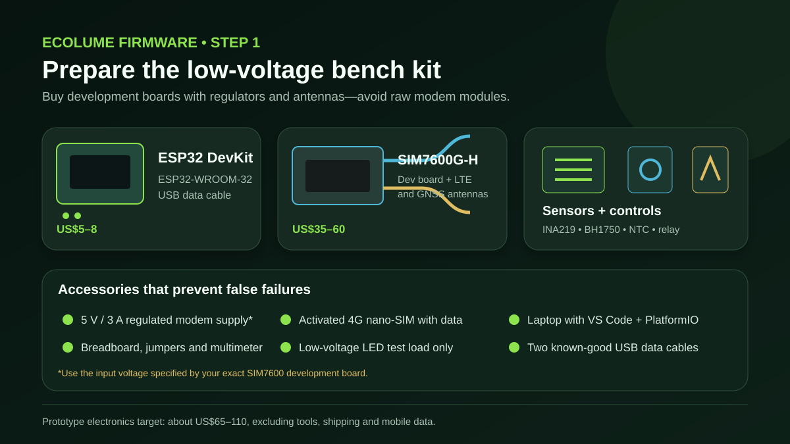

### Actual products to recognize in the market

These are real, searchable examples so a buyer can recognize each part. They are reference products, not mandatory brands; compare the exact voltage, connector, radio band, and pin labels before buying. The photos are stored in this repository so the guide still works offline.

| Product photo | What to search for |
|---|---|
| <br>**Espressif ESP32-DevKitC V4** | Search: `ESP32-DevKitC V4 ESP32-WROOM-32E`<br>[Official board guide](https://docs.espressif.com/projects/esp-dev-kits/en/latest/esp32/esp32-devkitc/user_guide.html)<br>This is the closest recognizable reference for the `esp32dev` pin map used below. |
| 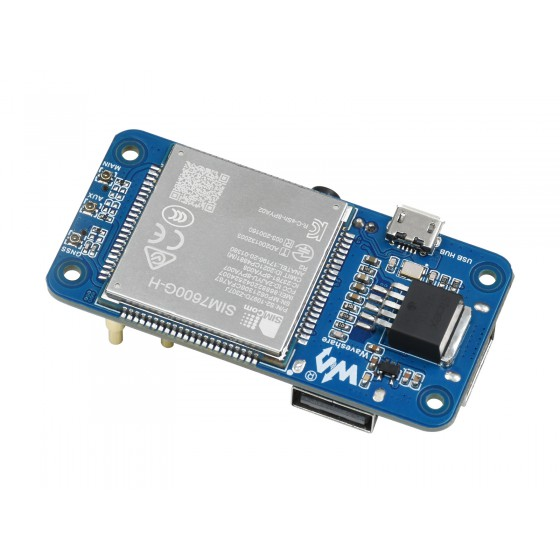<br>**Waveshare SIM7600G-H 4G HAT (B)** | Search: `Waveshare SIM7600G-H 4G HAT B global GNSS`<br>[Manufacturer product page](https://www.waveshare.com/sim7600g-h-4g-hat-b.htm)<br>Look for the board, LTE/GNSS antennas, USB cable, and correct power accessories. |
| 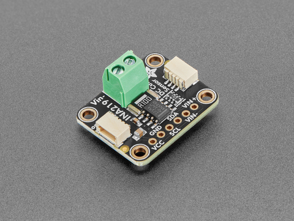<br>**Adafruit INA219 breakout, product 904** | Search: `Adafruit 904 INA219 current sensor breakout`<br>[Manufacturer product page](https://www.adafruit.com/product/904)<br>Use only for the low-voltage DC experiment described in this guide. |
| 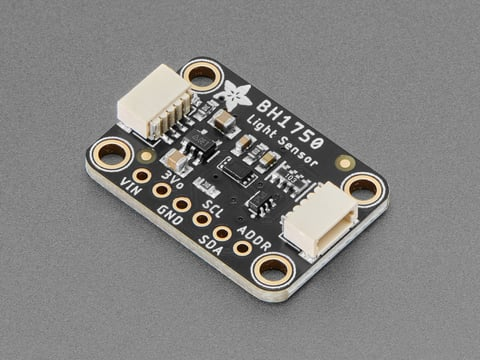<br>**Adafruit BH1750 breakout, product 4681** | Search: `Adafruit 4681 BH1750 light sensor`<br>[Manufacturer product page](https://www.adafruit.com/product/4681)<br>Generic GY-302/BH1750 boards can also work if their voltage and I²C pins match. |
| 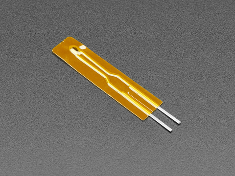<br>**10 kΩ NTC thermistor, B3950** | Search: `10K NTC thermistor 1% B3950` or `Adafruit 4890`<br>[Manufacturer product page](https://www.adafruit.com/product/4890)<br>Buy a separate 10 kΩ 1% resistor for the voltage divider. |
| 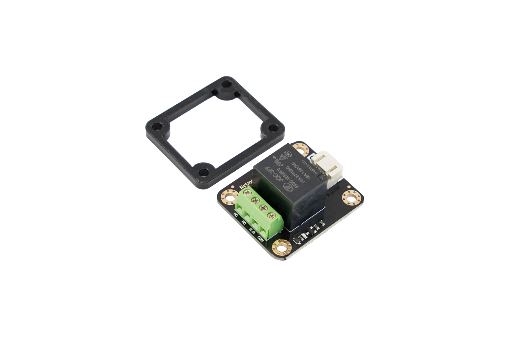<br>**DFRobot DFR0017 relay module** | Search: `DFRobot DFR0017 opto isolated relay module`<br>[Manufacturer product page](https://www.dfrobot.com/product-64.html)<br>Use this pictured module only for safe bench ON/OFF tests. It is **not** the street-light mains contactor. |
| 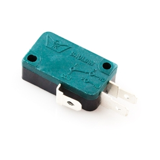<br>**SparkFun COM-09506 three-terminal microswitch** | Search: `SparkFun COM-09506 microswitch 3 terminal`<br>[Manufacturer product page](https://www.sparkfun.com/microswitch-3-terminal.html)<br>A three-terminal COM/NO/NC switch makes it easy to follow the normally-closed tamper wiring below. |

The SIM card, antennas, power supply, cables, breadboard, jumpers, and low-voltage test load are generic accessories. Match each antenna and connector to the exact modem kit, and follow the modem-board manual for its supply. For field-ready power, surge protection, metering, and enclosure examples, see the [hardware equipment and picture guide](../docs/HARDWARE.md). Image origins are recorded in the [equipment source register](../docs/assets/equipment/SOURCES.md).

### Essential communication kit

| Qty | Item | Minimum specification | Typical cost | Buying note |
|---:|---|---|---:|---|
| 1 | ESP32 DevKit | ESP32-WROOM-32, USB interface, exposed GPIO | $5–8 | Choose a common `esp32dev`-compatible board |
| 1 | SIM7600 development board/HAT | **SIM7600G-H/global bands**, UART access, onboard regulator, SIM slot | $35–60 | Prefer a kit including LTE and GNSS antennas |
| 1 | LTE antenna | Matches the board connector and supported bands | $3–6 | Not needed separately if included |
| 1 | Active GNSS antenna | Matches the GNSS connector and board support | $4–8 | A magnetic antenna is easier to place near a window |
| 1 | Activated 4G SIM | Data service, known APN, SMS/voice not required | Carrier-dependent | Test the selected Cambodian carrier at the intended pole location |
| 1 | Modem power supply | Regulated supply specified by the modem-board vendor; commonly 5 V, at least 3 A | $6–10 | **Never** power the modem from the ESP32 3V3 pin |
| 2 | USB data cables | Known-good data cables, not charge-only | $4–8 | One spare avoids many upload problems |
| 1 | Breadboard + jumpers | Male-to-male and male-to-female | $5–9 | For low-voltage bench wiring only |

### Sensors and control parts

| Qty | Item | Purpose | Typical cost | Limit |
|---:|---|---|---:|---|
| 1 | INA219 module | Low-voltage DC current/power experiment | $2–5 | Not for mains or the luminaire's high-voltage output |
| 1 | BH1750 module | Ambient-light measurement | $1–3 | Mount away from direct lamp glare in a field enclosure |
| 1 | 10 kΩ NTC + 10 kΩ resistor | Enclosure or heat-sink temperature prototype | <$1 | Must be calibrated after installation |
| 1 | 3.3 V-compatible opto-isolated relay module | Logic-level ON/OFF experiment | $2–5 | Hobby module is not a field contactor |
| 1 | Normally closed microswitch | Cabinet tamper input | $1–2 | Select a durable lever/plunger style |
| 1 | Low-voltage LED/load | Safe control and metering test | $3–8 | Use 5–12 V DC within module ratings |

### Tools

- Laptop with VS Code and the PlatformIO extension, or PlatformIO Core.
- Digital multimeter; do not continue if supply polarity or voltage is uncertain.
- Small screwdriver, wire cutter/stripper, insulating tape, labels, and reusable cable ties.
- Optional USB power meter or bench supply with current limit for diagnosing modem resets.

### Save money without reducing safety

- Buy a SIM7600 **development board**, not a bare LGA module. The carrier PCB, SIM holder, regulator, antenna connectors, and level interface are worth more than the small headline saving.
- Avoid SIM800/SIM900 2G boards. This project is designed for LTE and GNSS.
- Validate one carrier, APN, antenna, power supply, and board combination before volume purchasing.
- Reuse a multimeter, programmer cable, and bench supply across prototypes.
- Move to a custom PCB only after the pilot pinout, power behavior, antennas, and enclosure are stable.
- Never remove isolation, fusing, surge protection, earthing, or enclosure sealing to reduce field cost.

## Reference pin map

The tutorial matches `include/config.example.h`:

| Function | ESP32 pin | Connect to | Notes |
|---|---:|---|---|
| Modem RX | GPIO 26 | SIM7600 TXD | UART lines cross |
| Modem TX | GPIO 27 | SIM7600 RXD | Confirm 3.3 V-compatible logic |
| Modem PWRKEY | GPIO 4 | Board PWRKEY control | Optional; timing and polarity are board-specific |
| Modem power enable | GPIO 25 | Board power-enable control | Optional; do not connect without the board schematic |
| Lamp ON/OFF logic | GPIO 18 | Isolated relay/driver input | Never connect directly to lamp power |
| Dimming PWM logic | GPIO 19 | Isolated PWM-to-0–10 V/DALI interface | The final interface must match the LED driver |
| Cabinet tamper | GPIO 23 | Plunger microswitch COM; NC terminal to GND | Firmware reports tamper when the input is LOW |
| Temperature | GPIO 34 | NTC divider midpoint | ADC input only; calibrate it |
| I²C SDA | GPIO 21 | INA219 SDA + BH1750 SDA | Shared I²C bus |
| I²C SCL | GPIO 22 | INA219 SCL + BH1750 SCL | Shared I²C bus |
| Status LED | GPIO 2 | Onboard LED on many DevKits | Board-dependent |

## Step 2 — Wire power safely

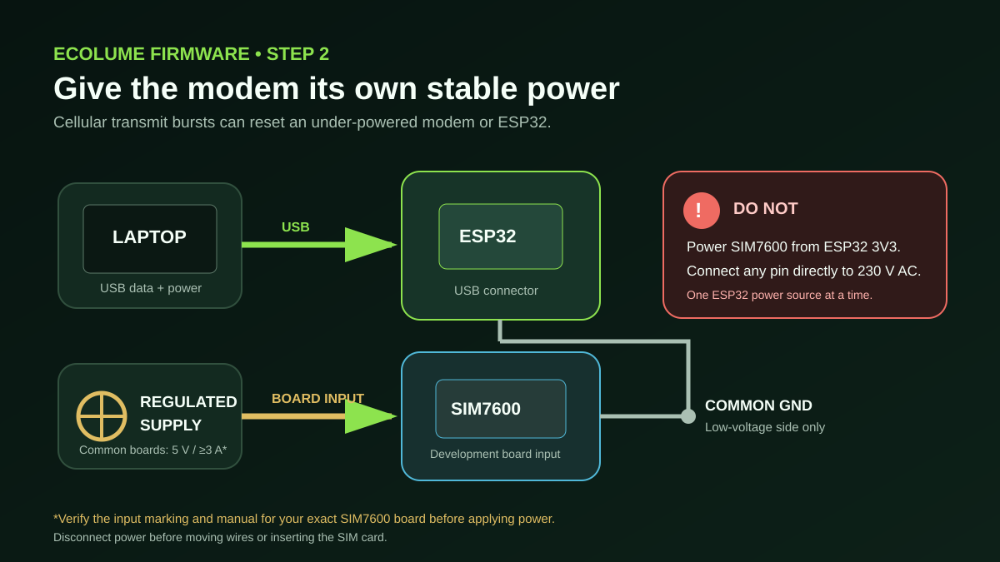

1. Disconnect all power.
2. Confirm the input voltage printed on the exact SIM7600 development board and in its hardware manual.
3. Power the ESP32 through its USB connector during setup.
4. Power the modem development board from its own stable, regulated supply. A common 5 V board should have at least 3 A available, but the board manual is authoritative.
5. Connect ESP32 GND to modem GND on the low-voltage side.
6. Before adding signal wires, measure supply polarity and voltage with a multimeter.

Do not simultaneously power an ESP32 DevKit through USB, its 5V pin, and its 3V3 pin. Espressif documents these as mutually exclusive power options.

## Step 3 — Connect the SIM7600 UART

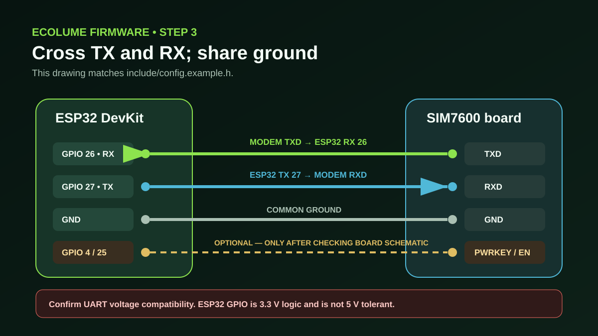

With power disconnected:

1. Connect **SIM7600 TXD → ESP32 GPIO 26 (RX)**.
2. Connect **SIM7600 RXD ← ESP32 GPIO 27 (TX)**.
3. Connect the two low-voltage grounds.
4. Leave GPIO 4 and GPIO 25 disconnected until the exact modem board's schematic confirms its PWRKEY/power-enable circuit, voltage, timing, and active polarity.
5. Confirm the board exposes 3.3 V-compatible UART logic. ESP32 GPIO is not 5 V tolerant.

Short UART wires are more reliable. If communication is intermittent, first check ground, TX/RX crossing, voltage compatibility, modem power stability, and the board's UART-selection jumpers.

## Step 4 — Add sensors

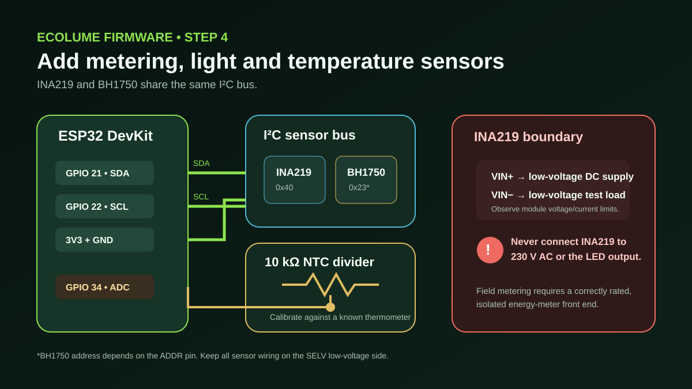

### INA219 and BH1750

1. Connect both module `VCC` pins to ESP32 `3V3` and both `GND` pins to GND.
2. Connect both `SDA` pins to GPIO 21.
3. Connect both `SCL` pins to GPIO 22.
4. Use an I²C scanner if a module is not detected. The default addresses are normally `0x40` for INA219 and `0x23` or `0x5C` for BH1750.
5. Put INA219 `VIN+` and `VIN-` in series only with the safe, low-voltage DC test load and stay within the specific module's limits.

The INA219 in this reference is a bench sensor. Production AC energy metering requires a certified, isolated and correctly rated meter/front end.

### NTC temperature divider

1. Make a divider from a 10 kΩ fixed resistor and 10 kΩ NTC.
2. Connect the divider midpoint to GPIO 34.
3. Keep the voltage at GPIO 34 within the ESP32 ADC range.
4. Compare readings with a known thermometer at several temperatures and store calibration coefficients for the selected NTC and mounting point.

## Step 5 — Connect control and tamper signals

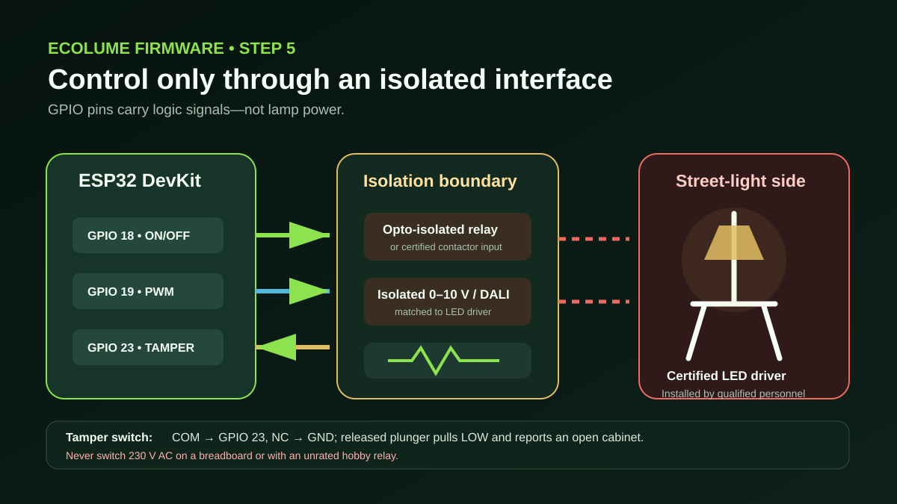

- **GPIO 18** provides the ON/OFF logic signal. On the bench, feed it only into a 3.3 V-compatible isolated-input module.
- **GPIO 19** provides PWM logic. A field installation needs a certified isolated interface that converts this signal to the LED driver's supported control, such as 0–10 V or DALI.
- **GPIO 23** connects to `COM` on a plunger microswitch; connect the switch's `NC` terminal to GND. Mount it so the closed cabinet presses the plunger and opens COM–NC. Opening the cabinet releases the plunger, closes COM–NC, pulls GPIO 23 LOW, and reports tamper.
- Determine the relay's active level before connecting a lamp. Confirm the lamp remains in the designed fail-safe state while the ESP32 resets or is unpowered.

> [!WARNING]
> Do not place 230 V AC on a breadboard. Do not route mains through a hobby relay. Do not join the mains/LED power side to ESP32 ground.

## Step 6 — Configure and flash

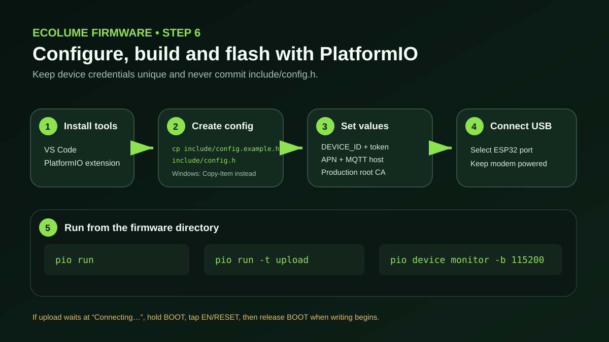

### 1. Install PlatformIO

Install [VS Code](https://code.visualstudio.com/) and the [PlatformIO IDE extension](https://platformio.org/install/ide?install=vscode), or install PlatformIO Core. Open the repository's `firmware` directory as the project.

### 2. Create the private configuration

macOS/Linux:

```bash
cp include/config.example.h include/config.h
```

PowerShell:

```powershell
Copy-Item include/config.example.h include/config.h
```

`include/config.h` is git-ignored. Do not commit production tokens, APNs with credentials, or private certificates.

### 3. Set every required value

Edit `include/config.h`:

```cpp
#define DEVICE_ID "KH-PNH-000001"
#define DEVICE_TOKEN "replace-with-a-unique-random-32-byte-or-longer-token"

#define CELLULAR_APN "apn-provided-by-carrier"
#define CELLULAR_USER ""
#define CELLULAR_PASSWORD ""
#define CELLULAR_PIN ""

#define MQTT_HOST "mqtt.example.gov.kh"
#define MQTT_PORT 8883
```

Also replace the placeholder `MQTT_ROOT_CA` with the issuing CA certificate for the production broker. One controller must have one immutable device ID and one unique token. Never copy a demonstration or simulator token to a field unit.

### 4. Build, upload, and monitor

Run from `firmware/`:

```bash
pio run
pio run --target upload
pio device monitor --baud 115200
```

PlatformIO downloads the pinned framework and libraries from `platformio.ini`. If upload remains at `Connecting...`, hold the ESP32 **BOOT** button, tap **EN/RESET**, and release **BOOT** when writing starts. A missing serial port usually means the USB cable is charge-only or the USB-UART driver is missing.

## Step 7 — First end-to-end test

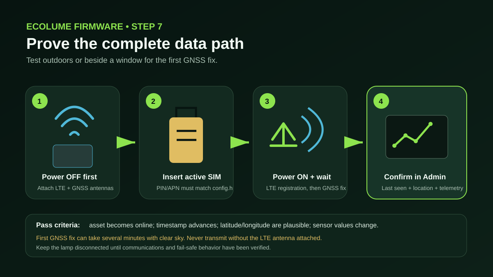

1. With power **off**, insert the activated SIM and attach both LTE and GNSS antennas.
2. Put the GNSS antenna outdoors or beside a window with a wide sky view.
3. In the admin system, create the asset with the same `DEVICE_ID` and provision its unique credential and MQTT ACL.
4. Power the modem, then the ESP32.
5. Wait for LTE registration. A first GNSS fix can take several minutes.
6. Open the EcoLume admin page and confirm:
   - the correct asset becomes online;
   - `last seen` advances;
   - latitude/longitude are plausible;
   - voltage, current, power, temperature, and lux values are plausible;
   - opening the tamper switch creates the expected event;
   - an authorized brightness command reaches only that device.
7. Leave the real street-light output disconnected until communication, sensor calibration, reset behavior, and fail-safe logic pass.

### Provisioning requirements

Each controller needs:

- an immutable asset and device ID using the agreed province/city naming scheme;
- a cryptographically random device token of at least 32 bytes;
- a broker ACL limited to its own telemetry/event publish topics and command subscription;
- the production broker hostname and CA certificate;
- carrier/APN settings and an installation record;
- the final pole ID, province/city, GPS location, luminaire/driver model, wattage, SIM ICCID, firmware version, and installer.

Do not use a shared “Cambodia fleet” credential. Revocation and incident response must work per controller.

## Troubleshooting

| Symptom | Most likely checks |
|---|---|
| ESP32 has no serial port | Try a known data cable, another USB port, and the board's USB-UART driver |
| Upload waits at `Connecting...` | Use BOOT/EN sequence; disconnect circuits from boot-strapping pins; select the correct port |
| Modem repeatedly resets | Dedicated supply capacity, cable voltage drop, loose ground, correct board input voltage |
| No UART response | Cross TX/RX, common ground, 3.3 V logic, baud rate, board UART jumpers, PWRKEY sequence |
| SIM not registered | SIM activation, SIM PIN, APN, LTE antenna, carrier coverage, supported SIM7600 band variant |
| LTE works but MQTT fails | Correct time, broker DNS/port, APN internet access, root CA, device credential, broker ACL |
| No GNSS fix | GNSS antenna on the correct connector, active-antenna support, sky view, sufficient first-fix time |
| INA219/BH1750 missing | 3.3 V/GND, SDA 21, SCL 22, I²C address, soldered headers, short wires |
| Power reading is zero/reversed | INA219 series path and `VIN+`/`VIN-` direction; use only a low-voltage test load |
| Temperature is implausible | Divider order/value, GPIO 34 voltage, NTC beta value, calibration, self-heating |
| Relay behavior is reversed | Active-low versus active-high input and safe state during boot/reset |
| Admin asset stays offline | Exact `DEVICE_ID`, MQTT topic prefix, credential, ACL, backend/broker reachability |

## Bench acceptance checklist

- [ ] Supply voltage and polarity measured before power-on.
- [ ] Modem remains stable during LTE attach and data transfer.
- [ ] LTE and GNSS antennas attached to the correct connectors.
- [ ] Unique device ID, credential, ACL, and production CA installed.
- [ ] Asset appears online and telemetry timestamps advance.
- [ ] GNSS position and every sensor are plausibility-checked and calibrated.
- [ ] Tamper, ON/OFF, dimming, reset, and power-loss behavior tested.
- [ ] Command authentication and device/topic isolation tested.
- [ ] 72-hour broker/network outage and recovery test completed.
- [ ] Real luminaire remains disconnected until field interface review is complete.

## Production field equipment

The prototype parts above are not a production street-light controller. A field design normally adds:

| Area | Required field-grade equipment or work |
|---|---|
| Power | Certified isolated AC/DC supply with temperature derating; correctly rated MCB/fuse |
| Surge/lightning | Coordinated SPD/MOV/GDT protection selected for the cabinet, pole, and local earthing system |
| Lamp control | Certified isolated DALI, 0–10 V, or driver-specific interface; correctly rated contactor if power switching is required |
| Metering | Isolated, correctly rated energy meter/front end suitable for the actual AC or DC measurement point |
| Enclosure | UV-resistant IP65/IP66 enclosure, DIN rail, terminals, strain relief, cable glands, condensation control |
| RF/GNSS | Outdoor-rated antennas or sealed bulkhead connectors, cable-loss review, carrier survey |
| Earthing | Protective earth and bonding designed and verified by qualified electrical personnel |
| PCB/security | Designed PCB, watchdog, brownout protection, secure boot, flash encryption, signed OTA, rollback |
| Quality | Thermal test, ingress test, surge/EMC review, burn-in, serial/QR labels, installation and maintenance records |

Before a 25-province/city rollout, deploy a small multi-carrier pilot in representative urban, rural, coastal, hot, wet, and weak-signal sites. Record failure causes and service time before freezing the production hardware.

## Official references

- [Espressif ESP32-DevKitC V4 getting started guide](https://docs.espressif.com/projects/esp-idf/en/release-v4.0/hw-reference/get-started-devkitc.html)
- [SIMCom SIM7600 technical files](https://www.simcom.com/technical_files.html?filetype=0&pro_cat=0&pro_li=15&time=0)
- [SIMCom SIM7600G-H R2 product page and application notes](https://en.simcom.com/product/SIM7600G-H_R2.html)
- [PlatformIO Espressif32 documentation](https://docs.platformio.org/en/latest/platforms/espressif32.html)
- [Adafruit INA219 wiring guide](https://learn.adafruit.com/adafruit-ina219-current-sensor-breakout/wiring)
- [Espressif ESP32 ADC documentation](https://docs.espressif.com/projects/esp-idf/en/v4.3.1/api-reference/peripherals/adc.html)
